# Link_BLE
### Bluetooth를 이용한 선박간의 접근 통제 및 긴급통지 시스템 개발

#### 목적

Non-SOLAS(Non-Safety Of Life At Sea : SOLAS 선박은 해상인명안전협약(SOLAS)에 명시된 특정 톤수 이상의 국내외를 항해하는 화물선과 여객선을 말하며, 그 외 어선, 소형 선박과 요트를 포함한 레저 선박은 모두 Non-SOLAS대상 선박이라고 함) 선박에서 사용 가능한 긴급 통지 시스템을 개발하여 해상사고의 대다수를 차지하는 어선 충돌사고를 방지하는 것이 목적이다.

#### 기술개발의 필요성

- Non-SOLAS 대상 선박의 충돌사고 사전통지의 필요성

   전체해양사고의 71.2%가 어선에서 발생하고 있고 어선과 같은 소형선박 사고 중 충돌사고는 68.4%를 차지 할 만큼 높다. 이러한 선박의 사고는 육지와 달리 실제 선박에 승선한 인원 모두의 생명을 위협하는 경우가 많다. 이에 충돌사고에 대비하여 최소 범위내에서 접근 신호를 통지 함으로 많은 사고를 줄일 수 있다.

- 추가적 저가의 사전 통지 시스템의 필요성

  해상조난안전시스템(GMDSS)에서 규정하는 안전 시스템 구축은 기본적으로, VHF 통신장비, 레이더와 GPS 수신장비 및 AIS 선박자동식별 장비를 요구하고 있다 (선박안전관리메뉴얼, 2011). 특히 소형 선박의 경우 완벽하게 장비하기에는 경제적 부담이 크다. 이러한 문제점을 해결하면서 레이더를 보조 할 수 있는 저가의 별도 통지 시스템이 필요하다.

- Local 무선 네트워크 구성에 대한 연결 필요성

  현재 해양수산부에서는 한국형 e-navigation을 위하여 2016년 10월부터 사업을 시작하여 LTE-M(LTE-Maritime)을 구축하여 육상에서 최대 100Km 이내까지 서비스를 목표로 하고 있다. 하지만, LTE-M은 기지국을 중심으로 구축되며, 기지국 신호절단, 음영 지역 및 기지국 부재 시 문제를 해결 하여야 한다. 이러한 문제를 해결하기 위해 무선 센서의 역할은 크다. 단일 로컬망의 구성에 효과적인 방법이 필요하지만, 현재 한국형 e-navigation에서는 고려되지 않고 있다.


# 연구 개발의 목표

#### 저전력 인식장치 개발

- BLE(Bluetooth Low Energy) 기술을 이용한 소형 선박에서의 최소 전력을 사용하면서 안정적인 인식장치를 개발

#### 단독 제어 기술 개발

- 외부 시스템의 신호절단, 음영 지역 및 기지국 부재 등의 문제와 관계없이 신호를 외부에 전달하고 이를 수신할 수 있는 독립적 시스템 구성

#### 효율적 선내 통지 시스템 구성

- 신호 거리에 따른 선별적 신호를 전달함으로써, 선내에 위험을 단계별로 통지하는 시스템을 구축하여 불필요한 통지를 제어

#### 선택적 수신 장비 제어

- 다양한 장비에 대한 식별 및 적절한 장비 선택을 지원하여, 인식 오류를 최소화하여 구현

#### 장비 저가 실현

- 최소한의 시스템 구성으로 소형선박의 환경에 적합하며, 단일 제품으로 구성하여 불필요한 서비스를 제한하는 저가 시스템 개발


# 기술 개발 내용 및 결과

### 기술개발 이해

- Non-SOLAS 선박에서 사용 가능한 <span style="color:red">**저전력, 저비용의 선박간 접근 통제 및 긴급 통지 시스템**</span>을 제작하는 것을 목표

- Bluetooth를 이용한 주변 장비 검색 및 유효 장비 구분
- 제한된 속도 범위내의 타 선박 접근에 대한 선내 통지 서비스
- 블루투스 수신범위를 최소 50m에서 1Km로 개발 (지향성 안테나 포함)

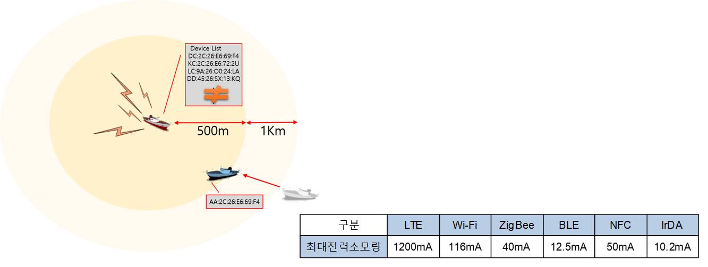

### 시스템 구조

- 시스템 구조

  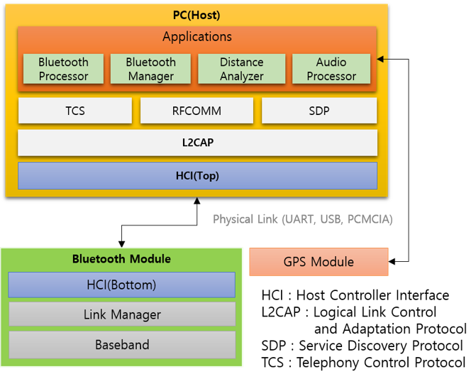

- 선내 통지 설정

  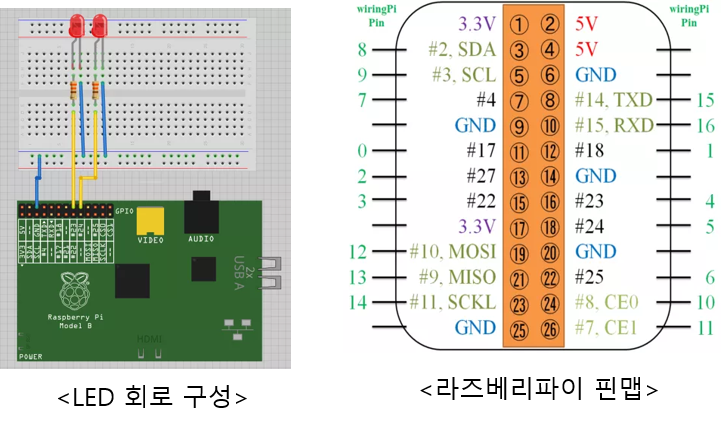

- 인터페이스

  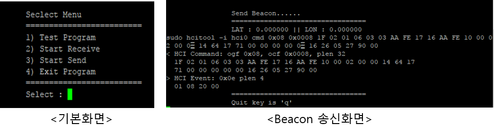

### 시스템 주요 특징

- BLE의 광고 메시지를 이용한 Message 전달 방식

- 애플의 IBeacon과 구글의 Eddystone 모두 GPS 전달 Format이 없음

- 구글의 Eddystone Format 중 Eddystone-URL 부분에 좌표 입력 및 전달

  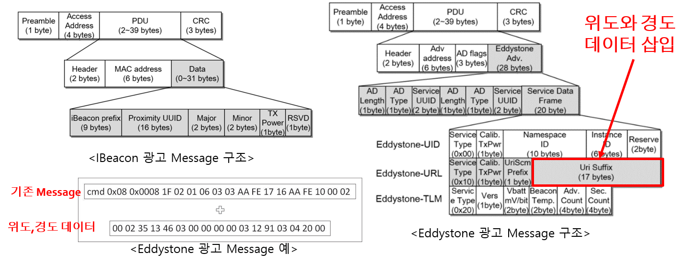

### 거리 신뢰성 결과

#### 육상 실험


- RSSI만 사용한 개발 시스템과 GPS를 이용한 시스템의 비교

- 광안비치 방파제(총거리 650m)에서 30m 단위로 측정

- GPS를 이용한 결과가 압도적으로 정확하게 측정 됨

  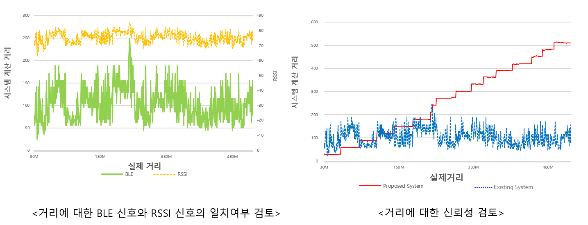

#### 해상 실험

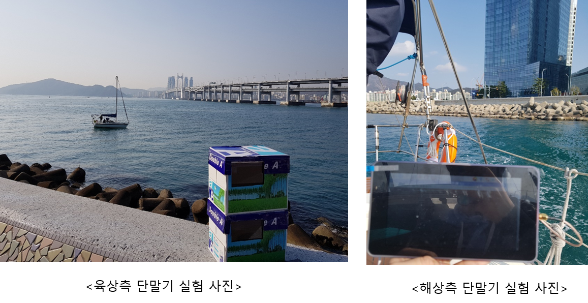

- GPS를 이요한 거리 측정 및 수신 테스트 실험

- 광안대교 부근 2km 내외

- 최대 약 1km 거리까지의 거리 측정 성공

  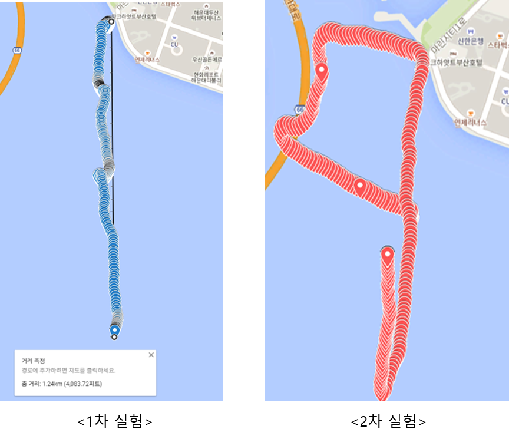


# 개발 환경

### Board - raspberry pi 3

- raspberry pi 3는 Non-SOLAS 선박에서 많은 자리를 차지하지 않을 만큼 작고 저전력에 가격 또한 비교적 저렴하고 GPS 신호를 받아 BLE 신호를 송신하고 수신한 BLE 신호를 분석하여 거리를 측정하기에 충분한 프로세서와 메모리를 가지고 있어 응답시간을 낮출 수 있다.
- GPS 모듈과 블루투스 어댑터를 위한 USB 인터페이스를 갖추고 있고 긴급통지를 시각 및 청각으로 제공 할 수 있도록 HDMI와 gpio pin 등이 있다.

### Bluetooth Module - Parani-UD100

- 블루투스 4.0 Class 1 지원하고 기본 통신 거리가 300m이고 옵션 안테나 이용 시 최대 1000m까지 통신이 가능하다 인터페이스는 USB 2.0을 지원한다.
- 블루투스 프로파일은 DUN, FAX, LAP, SPP, HID, HCRP, FTP, OPP, A@DP, AVRCP, GAVDP, HSP, HFP, PAN, BIP 등을 지원하고 Windows xp/vista, Linux, MAC OS X등의 운영체제에서 동작한다.

### GPS Module - BU-353-s4 (GlobalSat)

- GPS 수신기로 SiRF Star IV GPS 칩셋으로 구동되며 도시, 협곡, 숲속에서 우수한 성능을 제공한다.
- Windows10, MAC OSX, LInux 등에서 작동하며 USB 2.0 인터페이스를 지원한다.
- 자동차 네비게이션, 개인위치, 휴대전화 네비게이션, 해상 항법 장치 등에 적합하다.

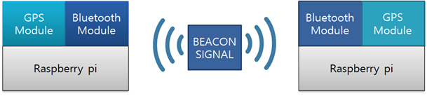


# installaion

### Bluez 설치

- 라즈베리파이가 Beacon 데이터를 보내게 하려면 몇 가지 툴을 설치해 줘야만 한다.

- 핵심은 BlueZ(리눅스 블루투스 스택)이고 부가적으로 libusb와 몇 개의 helper library가 필요하다.

  ```shell
  $ sudo apt-get install libusb-dev libdbus-1-dev libglib2.0-dev libudev-dev libical-dev libreadline-def
  
  $ sudo mkdir bluez
  $ cd bluez
  $ sudo wget www.kernel.org/pub/linux/bluetooth/bluez-5.11.tar.xz
  
  $ sudo unzx bluez-5.11.tar.xz 
  $ sudo tar xvf bluez-5.11.tar
  $ cd bluez-5.11
  $ sudo ./configure --disable-systemd
  $ sudo make
  $ sudo make install
  ```
  - BlueZ

    - 리눅스 상에서 블루투스 장비를 프로그래밍 하기 위해서는 보통 BlueZ Library를 이용(씨리얼 방식으로 통신하기도 함)

    - 리눅스 환경에서 Bluetooth 무선 표준 스펙을 구현한 Library로, 공식적으로 Kernel 2.4, 2.6을 지원

    - libusb-dev libdbus-1-dev libglib2.0-dev libudev-dev libical-dev libreadline-def : 

      blueZ 라이브러리

- 시스템에 설치된 디바이스 목록을 확인

  ```shell
  $ hciconfig
  hci0:  Type: BR/EDR    Bus: USB
         BD Address: 00:1A:7D:DA:71:12 ACL MTU: 310:10 SCO MTU: 64:8
         DOWN
         RX bytes: 495 acl:0 sco:0 events:21 errors: 0
         TX bytes: 89 acl:0 sco:0 commands: 21 errors: 0
  ```

- 만일 모든 것이 정상적으로 설정되어 있으면 위와 같은 hci 디바이스가 보이게 된다.

- 이제 디바이스를 활성화 시켜 준다. 또한 advertising을 할 때 문제를 일으킬 수도 있으므로 device scanning은 꺼 준다.

  ```shell
  $ sudo hciconfig hci0 up 
  $ sudo hciconfig hci0 leadv3 
  $ sudo hciconfig hci0 noscan
  ```

- Advertising data에 beacon 값을 넣어준다.

  ```shell
  $ sudo tools/hcitool -i hci0 cmd 0x08 0x0008 1E 02 01 1A 1A FF 4C 00 02 15 E2 0A 39 F4 73 F5 4B C4 A1 2F 17 D1 AD 07 A9 61 00 00 00 00 C8 00
  ```

### GPS 설치

- GPS 수신 관련 패키지 설치

  ```shell
  $ sudo apt-get install gpsd gpsd-clients
  ```

  - gpsd
    - GPS 수신기에서 데이터를 수신하고 Kismet 또는 GPS 탐색 소프트웨어와 같은 여러 응용 프로그램에 데이터를 다시 제공하는 Deamon
    - 다양한 유형의 수신자에게 통일 된 인터페이스를 제공하고 응용 프로그램에 의한 동시 액세스를 허용

- gpsd 설정

  ```shell
  Edit "/etc/default/gpsd"
  # Default settings for the gpsd init script and the hotplug wrapper.
  # Start the gpsd daemon automatically at boot time
  START_DAEMON=”true”
  # Use USB hotplugging to add new USB devices automatically to the daemon
  USBAUTO=”true”
  # Devices gpsd should collect to at boot time.
  # They need to be read/writeable, either by user gpsd or the group
  dialout.
  DEVICES=”/dev/ttyUSB0″
  # Other options you want to pass to gpsd
  GPSD_OPTIONS=”-F /var/run/gpsd.sock -b -n”
  ```

- gpsd 서비스를 재시작

  ```shell
  $ sudo systemctl enable gpsd
  $ sudo systemctl start gpsd
  $ sudo systemctl status gpsd
  
  gpsd.service – GPS (Global Positioning System) Daemon
  Loaded: loaded (/lib/systemd/system/gpsd.service; static)
  Active: active (running) since 水 2015-09-30 19:59:24 JST; 2min 14s ago
  Main PID: 1089 (gpsd)
  CGroup: /system.slice/gpsd.service
  mq1089 /usr/sbin/gpsd -N -F /var/run/gpsd.sock -b -n /dev/ttyUSB0
  ```

- cpgs -s 명령어로 gps 모듈 작동 상태 확인

  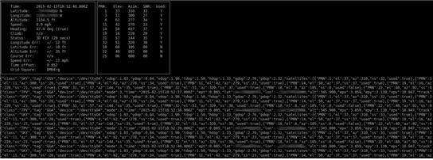

- 다양한 gps 정보 중 latitude, lomnggitude만 얻기 위해 shell을 작성(gps.sh)

  ```sh
  #!/bin/bash
  exec 2>/dev/null
  # get positions
  gpstmp=./gps.data
  
  rm $gpstmp $gpstmp"1"
  
  gpspipe -w -n 40 >$gpstmp"1"&
  ppid=$!
  sleep 5
  kill -9 $ppid
  cat $gpstmp"1"|grep -om1 "[-]\?[[:digit:]]\{1,3\}\.[[:digit:]]\{9\}" >$gpstmp
  size=$(stat -c%s $gpstmp)
  if [ $size -gt 10 ]; then
     cat $gpstmp|sed -n -e 1p >./gps.lat
     cat $gpstmp|sed -n -e 2p >./gps.lon
  fi
  ```

- shell을 통해 생성된 파일과 내용

  - gps.data1: "gpspipe -w -n 40"을 통해 출력되는 내용, gps에 관한 여러 정보들이 저장
  - gps.data : "cat $gpstmp"1"|grep -om1 "[-]\?[[:digit:]]\{1,3\}\.[[:digit:]]\{9\}" >$gpstmp" 명령어를 통해 출력 되는 내용, gps.data1에서 latitude와 longitude만 추출
  - gps.lat : "cat $gpstmp|sed -n -e 1p >/tmp/gps.lat"를 통해 출력되는 내용, latitude
  - gps.lon : "cat $gpstmp|sed -n -e 2p >/tmp/gps.lon"를 통해 출력되는 내용, longitude


# UML

### 유스케이스

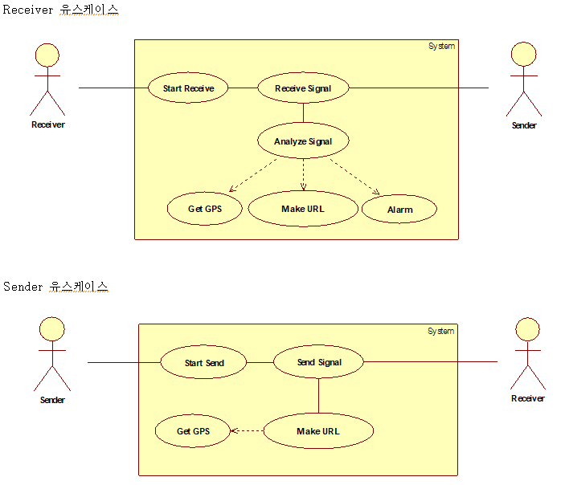

- Actor : Receiver와 Sender
- Receiver : Sender로 부터 신호를 수신 받고 이를 북석하여 위험 신호를 통지
- Sender : 자신의 현재 GPS 데이터를 URL에 실어 전송

### 클래스 다이어그램

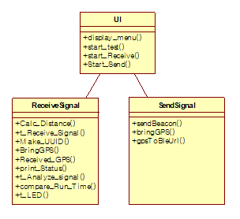

- UI : 사용자 인터페이스를 제공하기 위한 클래스
- ReceiveSignal : 신호를 수신 받아 분석하고, 알람을 통지
- SendSignal : GPS 데이터를 기반으로 신호를 발신

### 시퀀스 다이어그램

- Send Beacon Signal

  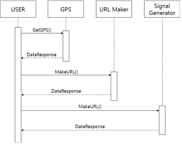

  - 사용자가 신호를 발신하고자 하면 GPS 데이터를 먼저 요구
  - GPS 데이터를 URL Maker를 통하여 URL 형태로 가공한 후 신호를 송신

- Receive Beacon Signal

  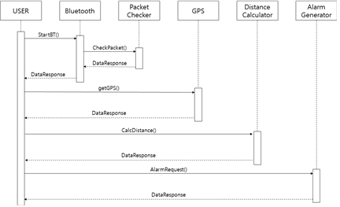

  - Bluetooth 장비를 구동한 후, 신호를 수신하였을 경우 Packer Checker가 GPS 데이터를 분리
  - 자신의 GPS 데이터를 가져와 두 GPS 데이터를 기반으로 두 기기간의 거리를 계산
  - Alarm Generator는 계산된 거리를 기반으로 알람을 울려준다


# Bluetooth Beacon Scanner

1. Beacon을 스캔하는 명령어인 “sudo hcitool lescan” 명령어를 이용하여 구현하기로 결정. 같은 Beacon 신호를 여러번 읽어와야 되기 때문에 “--duplicates” 옵션을 사용하여 구현하였습니다.

2. Beacon 신호를 scan 함(t_function 함수)과 동시에 신호의 세기를 이용하여 거리를 계산하고 파일에 저장하기 위하여(t_function2 함수) thread를 사용하여 구현하였습니다. 

3. thread1 에서는 먼저 “sudo hciconfig hci0 reset” 명령어를 popen 함수를 이용하여 실행하여 scan에 사용하는 bluetooth 장비를 reset 시켜준다. 그 후 “sudo hcitool lescan --duplicates 1> /dev/null” 을 백그라운드로 실행한다.

4. thread2에서는 thread1에 실행한 명령어를 통해 출력되는 값을 스크립트로 필터링하여 터미널로 입력하도록 하는 명령인 “sudo hcidump --raw”를 실행하여 UUID, URL 등이 포함된 정보를 얻어온다. 

    @참고 URL (http://blog.naver.com/PostView.nhn?blogId=juke45ef&logNo=220834142021&parentCategoryNo=&categoryNo=&viewDate=&isShowPopularPosts=false&from=postView)

5. 비콘과 원하는 신호를 구별하기 위하여 정규식을 이용하여 읽어온 신호를 구분하여 낸다. 이 때 사용한 함수는 <sys/types.h>와 <regex.h>의 regcomp()와 regexec()를 사용하였다. char 형으로 pattern을 만들어 regcomp 함수를 이용하여 컴파일 하고, 이를 regexec 함수를 이용하여 읽어온 신호와 비교하여 구분한다.

   @참고 URL (http://richong.tistory.com/199)

6. 읽어오는 데이터들이 한줄 단위로 읽어오기 때문에 필요한 부분을 연결하기 위하여 처리과정을 거친다. 이 때 16진수로 들어온 부분을 2진수로 바꾸기 위하여 strtol() 함수를 사용하였다.

7. Scanner Device의 현재 GPS 신호를 가져온다(lat, lon).

   1. 두 기기간의 GPS 정보를 이용하여 거리를 계산한다.

8. 측정한 거리 등의 정보를 저장하기 위하여 fopen 함수를 통해 파일에 저장하여였고, 이 때 파일 이름은 실행 시 입력하여줄 수 있게 구현하였다.

9. 컴파일은 gcc –o [실행파일이름] [C파일] -lpthread –lm 명령어를 입력하여 수행한다. 이 때 –lpthread 는 thread를 실행시키기 위한 함수에 관한 라이브러리를 포함하라는 의미이고, -lm 은 pow() 와 같은 math.h 헤더의 함수에 관한 라이브러리를 포함하라는 의미이다.


